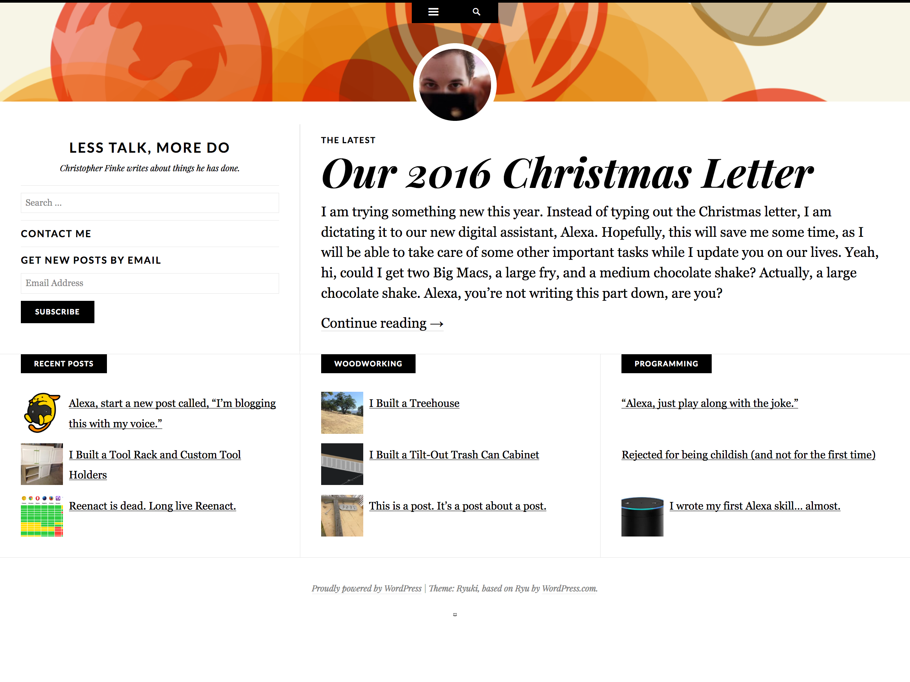

Ryuki
=====
Ryuki is a WordPress theme; it's a child theme of [Ryu](https://wordpress.org/themes/ryu/) that modifies the homepage to show just the excerpt of the latest post, a sidebar widget area, and three featured category sections, each with links to three posts.

To use Ryuki, install Ryu and Ryuki, activate Ryuki, and then choose your featured categories in the "Featured Categories" section of the Customizer.

Optionally, you'll want to set your front page to display a static page. Because Ryuki only shows the latest post on the front page, archive pagination links will always just show the single latest post if you don't set your home page to a static page. Just create an empty "Home" page and use that.

By default, Ryuki will just show links to your latest posts in the featured category sections. You can select up to three categories to use in those sections, and posts will not be duplicated if they appeared in both categories.

